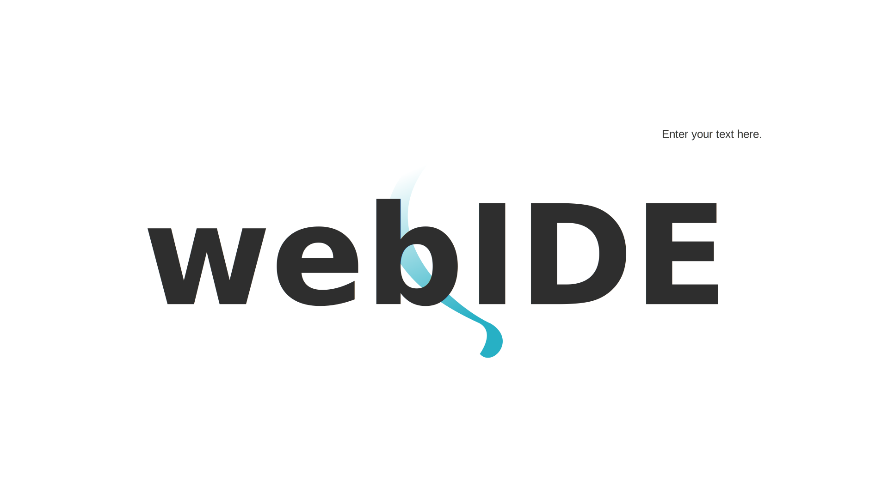
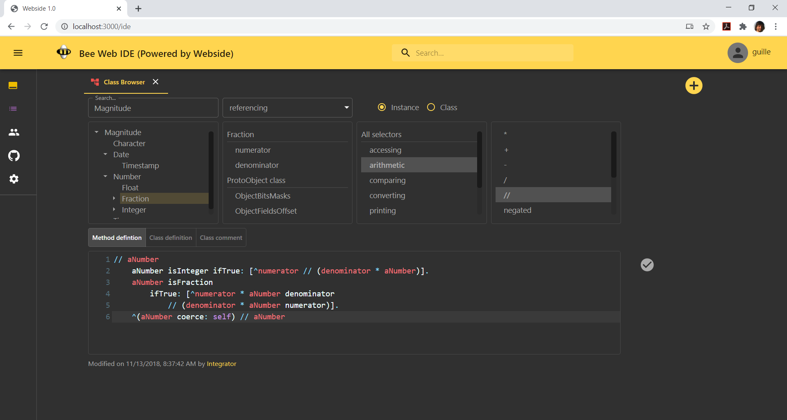
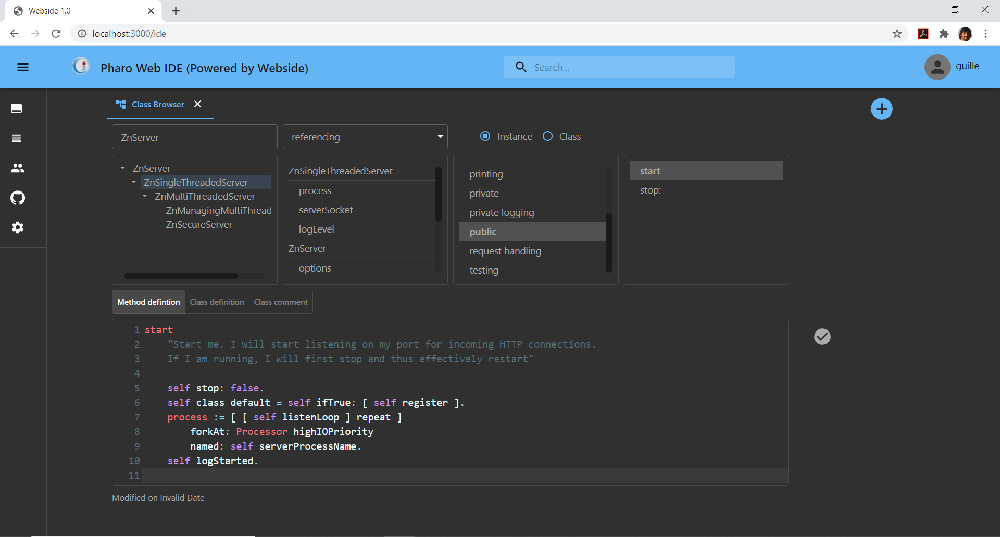
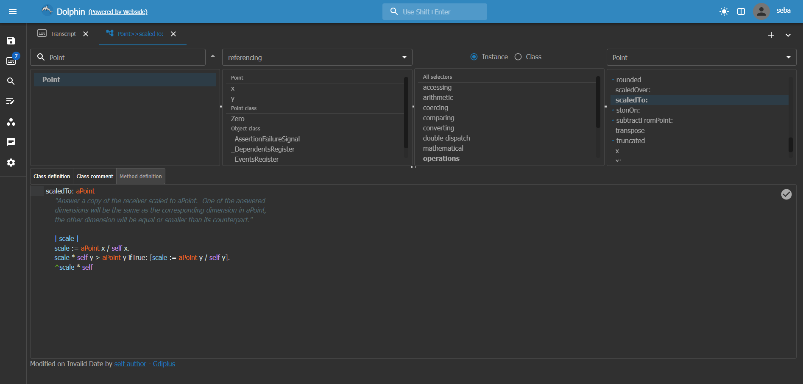

# Webside

<div align="center">



</div>

Smalltalk IDE for the web\
[**Explore the docs »**](docs/)\
\
[View Demo](https://webside-zglu.onrender.com) · [Report defect](https://github.com/guillermoamaral/Webside/issues/new?labels=Type%3A+Defect) · [Request feature](https://github.com/guillermoamaral/Webside/issues/new?labels=Type%3A+Feature)

Webside is both the specification of an [API](docs/api/) to interact with an Smalltalk system (backend), and a web [IDE](docs/) (frontend) built on top of such API.

The API definition follows this principle: _assume as less as possible from the underlying Smalltalk system_. This leads to keep a healthy distance from the particularities of a given dialect and its tooling, in favor of enabling the implementation of a common, yet useful set of tools (IDE) for every Smalltalk implementation.\
Of course, some assumptions are made and these impose some degree of _adaptation_ in the implementation of the API for a particular Smallalk.

Provided the API is implemented according to the specification, the IDE is fully operational on the Smalltalk at hand, offering traditional Smalltalk IDE tools such as code browsers, workspaces, inspectors, debugger and more.







Read more [here](docs/).

### Getting Started

#### Prerequisites (for development)

The following steps will demand both time and space, and are only intended to recreate the development environment in your local machine. In case you only want to use Webside to connect to some Smalltalk backend, you can skip these steps and go directly to [Usage](./#usage).

* npm

```sh
npm install npm@latest -g
```

* Your Smalltalk image implementing the [API](docs/api/)

#### Installation

1. Clone the repo

```sh
git clone https://github.com/guillermoamaral/Webside.git
```

2. Install npm packages under `client` folder

```sh
cd client
npm install
```

3. Launch Webside client

```sh
npm start
```

### Usage

The last step will open a web browser on a page like the one shown below, asking for the `URL` of the target Smalltalk system and the `username` to be used inside your Webside session (this is used as the `author` of modifications, and to be identified by peers in the same session)


The URL (port and base URI) will correspond to the one chosen by the web server running inside the Smalltalk system (for instance, the default configuration of Webside for Pharo at the moment of writing this documentation is http://{hostname}:9001/pharo)

### Demo

There is an online version available [here](https://webside-zglu.onrender.com). As mentioned above, it will prompt the URL where a Smalltalk system is listening. You can setup and launch Webside in Pharo as described in [Pharo-Webside](https://github.com/guillermoamaral/Pharo-Webside).

Also, here are a couple of talks I gave about this project:

* [FAST 2021](https://www.youtube.com/live/tM4mcTtajGQ?feature=share)
* [ESUG 2022](https://youtu.be/Q4gmWTTFoww)

### License

Distributed under the MIT License. See `LICENSE` for more information.

### Contact

Guille Amaral - guillermoamaral@gmail.com

Project Link: [https://github.com/guillermoamaral/Webside](https://github.com/guillermoamaral/Webside)
