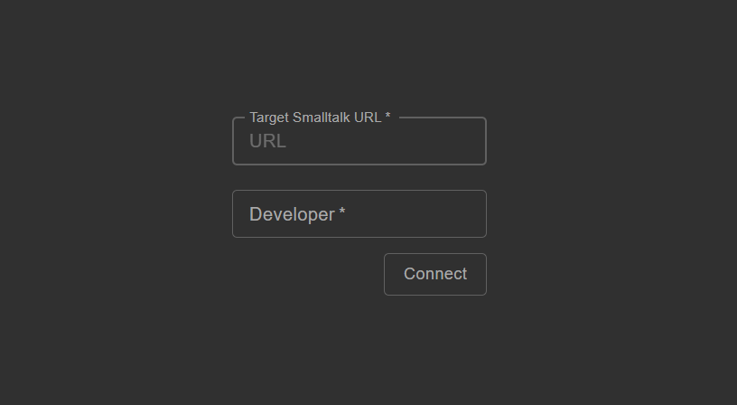

<!-- PROJECT LOGO -->
<br />
<p align="center">
  

  <p align="center">
    Smalltalk IDE for the web
    <br />
    <a href="https://github.com/guillermoamaral/Webside/blob/master/docs/README.md"><strong>Explore the docs »</strong></a>
    <br />
    <br />
    <a href="https://websideserver.azurewebsites.net">View Demo</a>
    ·
    <a href="https://github.com/guillermoamaral/Webside/issues/new?labels=Type%3A+Defect">Report defect</a>
    ·
    <a href="https://github.com/guillermoamaral/Webside/issues/new?labels=Type%3A+Feature">Request feature</a>
  </p>
</p>


## Webside
Webside is both the specification of an [API](docs/api) to interact with an Smalltalk system (back-end) and a web IDE (front-end) built on top of such API.

The IDE is a fully operational IDE, offering traditional Smalltalk IDE tools such as code browsers, workspaces, inspectors, debugger and more.


Read more [here](docs).

## Getting Started

### Prerequisites

* npm
```sh
npm install npm@latest -g
```

* Your Smalltalk image implementing the [API](docs/api)

### Installation

1. Clone the repo
```sh
git clone https://github.com/guillermoamaral/Webside.git
```
2. Install npm packages under `client` folder
```sh
cd client
npm install
```
3. Launch Webside client
```sh
npm start
```

## Usage
The last step will open a web browser on a page like the one shown below, asking for the `URL` of the target Smalltalk system and the `username` to be used inside your Webside session (this is used to sign code modifications and to be identified by peers in the same session) 



The URL (port and base URI) will correspond to the one chosen by the web server running inside the Smalltalk system (for instance, the default configuration of Webside for Pharo at the moment of writing this documentation is http://{hostname}:9001/pharo)

## Demo
There is an online version available [here](https://websideserver.azurewebsites.net). As mentioned above, it will prompt the URL where a Smalltalk system is listening. You can setup and launch Webside in Pharo as described in [Pharo-Webside](https://github.com/guillermoamaral/Pharo-Webside).

## License
Distributed under the MIT License. See `LICENSE` for more information.

## Logo
The logo is the result of a great job made by [ay! design](https://aydesign.art/). 

## Contact

Guille Amaral - guillermoamaral@gmail.com

Project Link: [https://github.com/guillermoamaral/Webside](https://github.com/guillermoamaral/Webside)


<!-- MARKDOWN LINKS & IMAGES -->
<!-- https://www.markdownguide.org/basic-syntax/#reference-style-links -->
[contributors-shield]: https://img.shields.io/github/contributors/othneildrew/Best-README-Template.svg?style=flat-square
[contributors-url]: https://github.com/othneildrew/Best-README-Template/graphs/contributors
[forks-shield]: https://img.shields.io/github/forks/othneildrew/Best-README-Template.svg?style=flat-square
[forks-url]: https://github.com/othneildrew/Best-README-Template/network/members
[stars-shield]: https://img.shields.io/github/stars/othneildrew/Best-README-Template.svg?style=flat-square
[stars-url]: https://github.com/othneildrew/Best-README-Template/stargazers
[issues-shield]: https://img.shields.io/github/issues/othneildrew/Best-README-Template.svg?style=flat-square
[issues-url]: https://github.com/othneildrew/Best-README-Template/issues
[license-shield]: https://img.shields.io/github/license/othneildrew/Best-README-Template.svg?style=flat-square
[license-url]: https://github.com/othneildrew/Best-README-Template/blob/master/LICENSE.txt
[linkedin-shield]: https://img.shields.io/badge/-LinkedIn-black.svg?style=flat-square&logo=linkedin&colorB=555
[linkedin-url]: https://linkedin.com/in/othneildrew
[product-screenshot]: images/screenshot.png
