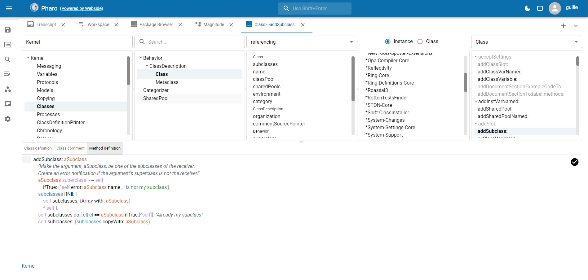
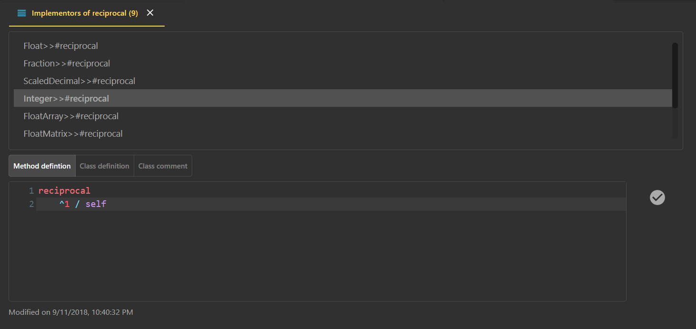

<!-- PROJECT LOGO -->
<br />
<p align="center">
  <h3 align="center">Webside</h3>

  <p align="center">
    Smalltalk IDE for the web
    <br />
    <a href="https://github.com/guillermoamaral/Webside/blob/master/docs/README.md"><strong>Explore the docs »</strong></a>
    <br />
    <br />
    <a href="https://github.com/guillermoamaral/Webside">View Demo</a>
    ·
    <a href="https://github.com/guillermoamaral/Webside">Report Bug</a>
    ·
    <a href="https://github.com/guillermoamaral/Webside">Request Feature</a>
  </p>
</p>

## Webside
Webside is both the specification of an [API](docs/api) to interact with a Smalltalk system (back-end) and a web IDE (front-end) built on top of such API.

The IDE is a fully operational IDE, offering traditional Smalltalk IDE tools such as class browser, workspace, inspector, debugger and more.




 

 

 


Read more [here](docs).

## Getting Started

### Prerequisites

* npm
```sh
npm install npm@latest -g
```

* Your Smalltalk image implementing the [API](docs/api)

### Installation

1. Clone the repo
```sh
git clone https://github.com/guillermoamaral/Webside.git
```
2. Install NPM packages
```sh
npm install
```

## Usage

Use this space to show useful examples of how a project can be used. Additional screenshots, code examples and demos work well in this space. You may also link to more resources.

_For more examples, please refer to the [Documentation](https://example.com)_

## License

Distributed under the MIT License. See `LICENSE` for more information.

## Contact

Guille Amaral - guillermoamaral@gmail.com

Project Link: [https://github.com/guillermoamaral/Webside](https://github.com/guillermoamaral/Webside)


<!-- MARKDOWN LINKS & IMAGES -->
<!-- https://www.markdownguide.org/basic-syntax/#reference-style-links -->
[contributors-shield]: https://img.shields.io/github/contributors/othneildrew/Best-README-Template.svg?style=flat-square
[contributors-url]: https://github.com/othneildrew/Best-README-Template/graphs/contributors
[forks-shield]: https://img.shields.io/github/forks/othneildrew/Best-README-Template.svg?style=flat-square
[forks-url]: https://github.com/othneildrew/Best-README-Template/network/members
[stars-shield]: https://img.shields.io/github/stars/othneildrew/Best-README-Template.svg?style=flat-square
[stars-url]: https://github.com/othneildrew/Best-README-Template/stargazers
[issues-shield]: https://img.shields.io/github/issues/othneildrew/Best-README-Template.svg?style=flat-square
[issues-url]: https://github.com/othneildrew/Best-README-Template/issues
[license-shield]: https://img.shields.io/github/license/othneildrew/Best-README-Template.svg?style=flat-square
[license-url]: https://github.com/othneildrew/Best-README-Template/blob/master/LICENSE.txt
[linkedin-shield]: https://img.shields.io/badge/-LinkedIn-black.svg?style=flat-square&logo=linkedin&colorB=555
[linkedin-url]: https://linkedin.com/in/othneildrew
[product-screenshot]: images/screenshot.png
