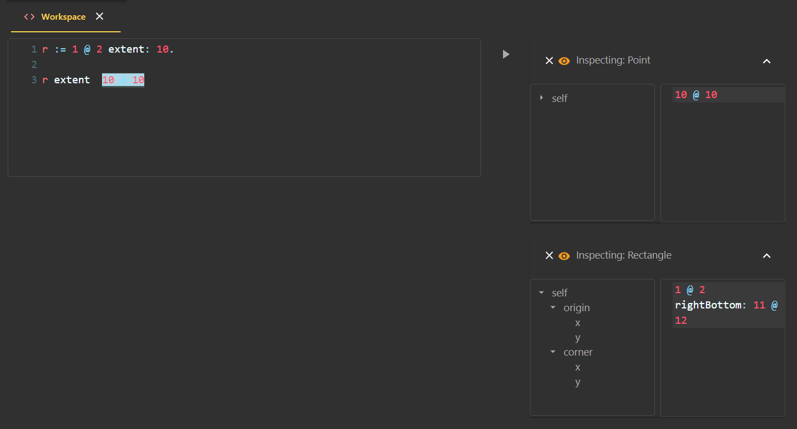
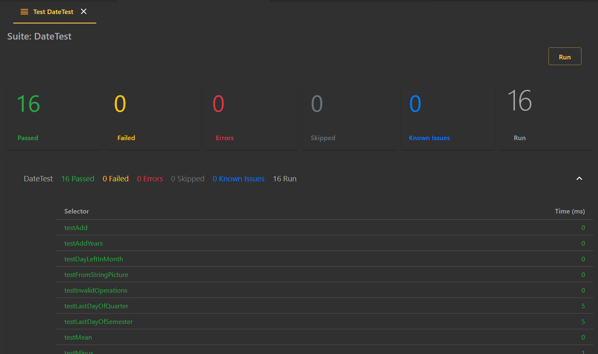

<!-- TABLE OF CONTENTS -->
## Table of Contents

* [About the project](#about-the-project)
  * [A bit of history](#a-bit-of-history)
  * [Key aspects](#key-aspects)
  * [Building blocks](#building-blocks)
* [IDE](#ide)
  * [Tools](#ide-tools) 
* [Getting Started](#getting-started)
  * [Prerequisites](#prerequisites)
  * [Installation](#installation)
* [Usage](#usage)
* [License](#license)
* [Contact](#contact)

<!-- ABOUT THE PROJECT -->
## About the project
Webside is both the specification of an API to interact with an Smalltalk system (back-end) and a web IDE (front-end) built on top of such API.

The [API](api) could be divided into two conceptually different subsets of endpoints:
* Static: used to browse and change the code
* Dynamic: used to evaluate expressions, both synchronically and asynchronically, and retrieve the resulting objects, as well as to debug and profile such expressions.

## A bit of history
This project started as a personal training with aim of learning React in particular, and improving my JavaScript skills in general.
As a passionate smalltalker and having implemented several web APIs in Smalltalk for differnt purposes and domains, I decided to expose Smalltalk itself thru a web API and see how far I could go implementing the classical Smalltalk IDE tools using React.

Being the dialect I use for my daily duties, I started by Bee Smalltalk as the back-end (porting the API to Pharo a fterwards*). Naturally, the API evolved as I progressed at the front-end side, starting by the "static" part (code) and then moving to the "dynamic" one (objects).

*_Not finished at the moment of writing this document._

## Key aspects
At some point in time, I realized that I shouldinvest all the effort in keeping the API simple in order to:
* Enable its implementation in a any Smalltalk dialect without a major effort,
* Make any improvement, change, or even a complete revamping of the IDE, easier.

As an extra lesson derived from the latter, I saw that: 
* Far from being a downside, having an Smalltalk IDE implemented in JavaScript would enable contributions from the JavaScript community to either enhance, change or extend Webside in any direction.
* Not only this IDE could be used to work upon different Smalltalk images but also it could allow for several developers to work on the same image at the same time, making Webside a collaborative environment.

### Building blocks
Webside is built using these frameworks and components (plus a set of packages not listed here):
* [ReactJS](https://reactjs.org): the main framework used to build Webside.
* [Material-UI](https://material-ui.com): a set of React useful components with handy interfaces and a coherent style.  
* [CodeMirror](https://codemirror.net/): the component used to display and edit code.

The IDE used for JavaScript was [Visual Studio Code](https://code.visualstudio.com).

## IDE
The global layout of Webside is made of the following:
  * A title bar, including a system search box (not implemented yet)
  * A left side bar with options to access the transcript, the system changes browse and other
  * A right side menu (plus button) to open some tools
  * A central container where the different tools are placed in the form of tabs
  * An emergent down area containing the transcript

### IDE tools
As as starting point I decided to recreate the traditional IDE tools of any Smalltalk environment. That is, a class (refactoring) browser, a method browser to list senders/implementors/references, a workspace to evaluate expressions and the corresponding counterpart, an inspector to navigate the resulting objects, and finally a debugger.

Additionally, I included a transcript pane where the user is notified, a system browser to manage some sort of projects, current changes browser, a simple chat, a test runner and a profiler.

In terms of internal design, every tool is implemented by a React component, with common parts such as the code editor or the method list shared by them.

As it is common to every Smalltalk IDE, every code space where the programmer can write expressions offers the options to evaluate (and/or showing/inspecting the resulting object), debug and profile expressions, plus a bunch of options to search classes and methods (senders, implementors, references, etc.) 

Having these basic tools implemented, it is possible to try new presentation alternatives and designs, (there is work outhere on this regard, look for instance [Glamorous toolkit](https://gtoolkit.com/)).

Again, the key point here is to keep the required API as simple as possible to ease its porting to an specific Smalltalk system, and then innovate on the presentation layer a much as the imagination flies.

### Class browser
This is more or less the classical refactoring browser, including the hierarchy of classes, their variables (plus some access filters), catetgories and methods at the top, and a code editor at the bottom.

The component implementing this tool is [ClassBrowser](../client/src/components/tools/ClassBrowser.js) and it relies in [Code](api/code) and [Changes](api/changes) endpoints to browse and make changes on the code, and in [Evaluations](api/evaluations) and [Objects](api/objects) endpoints to evaluate expressions. 

### Method Browser
This is a list of methods resulting from a search (senders, implementors, global references) with the corresponding method editor.

The component implementing this tool is [MethodBrowser](../client/src/components/tools/MethodBrowser.js) and as the `ClassBrowser` component it relies in [Code](api/code) and [Changes](api/changes) endpoints to browse and make changes on the code, and in [Evaluations](api/evaluations) and [Objects](api/objects) endpoints to evaluate expressions. 

### Workspace
Again this is the typical pane where the programmer can evaluate expressions (with its own variable scope to keep workspace temporaries) and print or inspect its results. Inspections triggered with the play button are embedded in the same workspace tab, while those inspections triggered with "Inspect" menu option (or its shortcut) are opened in a different tab.

The component implementing this tool is [Workspace](client/src/components/tools/ClassBrowser.js) and it essentially relies in [Evaluations](api/evaluations) and [Objects](api/objects) endpoints. 

### Inspector
Yet another standar Smallalk IDE tool, this inspector provides a tree view to dig into object references plus a code pane where to evaluate expressions. The evaluation context in this case contains `self` bound to the (root) object being inspected.

The React component implementing this tool is [Inspector](client/src/components/tools/Inspector.js) and it uses [Objects](api/objects) endpoints, specially the one to access object slots, [/objects/{id}/*](objects/id/slots/get.md).

### Debugger

### Test runner

### Profiler

