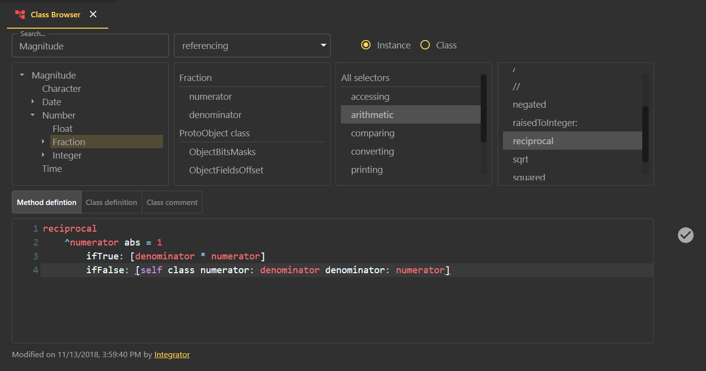
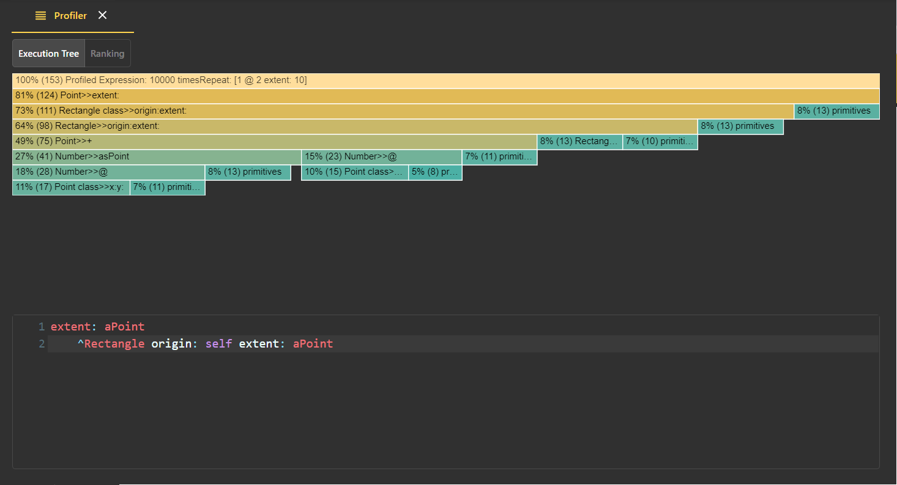
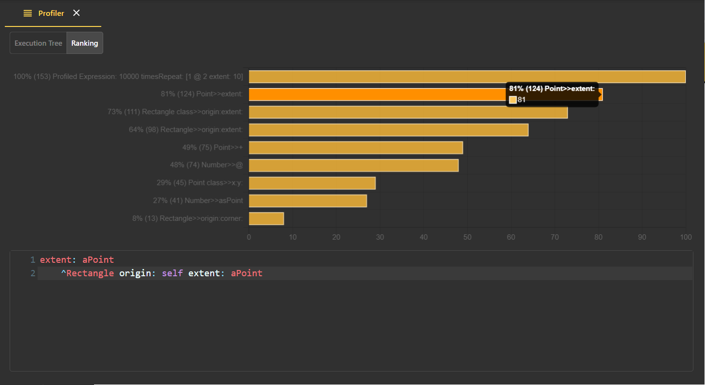

<!-- TABLE OF CONTENTS -->
## Table of Contents

* [About the project](#about-the-project)
  * [A bit of history](#a-bit-of-history)
  * [Key aspects](#key-aspects)
  * [Building blocks](#building-blocks)
* [API](api)
  * [Code](api/code)
  * [Changes](api/changes)
  * [Evaluations](api/evaluations)
  * [Objects](api/objects)
  * [Workspaces](api/workspaces)
  * [Debugging](api/debugging)
  * [Testing](api/testing)
  * [Profiling](api/profiling)
* [IDE](#ide)
  * [Tools](#ide-tools)
    * [Class Browser](#class-browser)
    * [Method Browser](#method-browser)
    * [Workspace](#workspace)
    * [Inspector](#inspector)
    * [Debugger](#debugger)
    * [Test Runner](#test-runner)
    * [Profiler](#profiler)
* [Getting Started](#getting-started)
  * [Prerequisites](#prerequisites)
  * [Installation](#installation)
* [Usage](#usage)
* [License](#license)
* [Contact](#contact)

<!-- ABOUT THE PROJECT -->
## About the project
Webside is both the specification of an API to interact with an Smalltalk system as a back-end and a web IDE built on top of such API as the front-end.

The [API](api) can be divided into two conceptually different subsets of endpoints:
* Static: used to browse and change code.
* Dynamic: used to evaluate expressions, both synchronously and asynchronously, and retrieve the resulting objects, as well as to debug and profile such expressions.

## A bit of history
This project started as a personal training with the aim of learning React in particular, and improving my JavaScript skills in general.
As a passionate smalltalker and having implemented several web APIs in Smalltalk for different purposes and domains, I decided to expose Smalltalk itself thru a web API and see how far I could go implementing the classical Smalltalk IDE tools using React.

Being the dialect I use for my daily duties, I started by Bee Smalltalk as the back-end (porting the API to [Pharo](https://github.com/guillermoamaral/Pharo-Webside) afterwards*). Naturally, the API evolved as I progressed at the front-end side, starting by the static part and then moving to the dynamic one.

*_Not finished at the moment of writing this document._

## Key aspects
At some point in time, I realized that I should invest all the effort in keeping the API simple in order to:
* Enable its implementation in any Smalltalk dialect without a major effort,
* Make any improvement, change, or even a complete revamping of the IDE, easier.

As an extra lesson derived from the latter, I found that: 
* Far from being a downside, having an Smalltalk IDE implemented in JavaScript enables contributions from the JavaScript community to either enhance, change or extend Webside in any direction.
* Not only this IDE could be used to work among different Smalltalk dialects but also it could allow for several developers to work on the same image at the same time, making Webside a collaborative environment.

### Building blocks
Webside is built using these frameworks and components (plus a set of packages not listed here):
* [ReactJS](https://reactjs.org): the main framework used to build Webside.
* [Material-UI](https://material-ui.com): a set of React useful components with handy interfaces and a coherent style.  
* [CodeMirror](https://codemirror.net/): the component used to display and edit code.

The IDE used for JavaScript was [Visual Studio Code](https://code.visualstudio.com).

## IDE
The global layout of Webside is the following:
  * A title bar, including a system search box (not implemented yet)
  * A left side bar with options to access the transcript, the system changes browse and other
  * A right side menu (plus button) to open tools
  * A central container where the different tools are placed in the form of tabs
  * An emergent area (at the bottom) containing the transcript

### IDE tools
As a starting point I decided to recreate traditional Smalltalk IDE tools. That is, a class (refactoring) browser, a method browser to browse senders/implementors/references, a workspace to evaluate expressions and the corresponding counterpart, an inspector to dig into the resulting objects, and finally a debugger.

Additionally, I included a transcript where the user can be notified*, a system browser to manage some sort of projects, current changes browser, a simple chat, a test runner and a profiler.

In terms of internal design, every tool is implemented by a React component, with common parts such as the code editor or the method list shared by them.

As it is common to every Smalltalk IDE, every code space where the programmer can write expressions offers the options to evaluate (and/or showing/inspecting the resulting object), debug and profile expressions, plus a bunch of options to search classes and methods (senders, implementors, references, etc.) 

Having these basic tools implemented, it is possible to try new presentation alternatives and designs.

Again, the key point here is to keep the required API as simple as possible to ease its porting to an specific Smalltalk system, and then innovate on the presentation layer a much as the imagination flies.

*_This transcript is used to emit notifications from the front-end side, such as API errors, but it is not connected to the Transcript global in the back-end. To do that, the server should send notifications to the client, but it is not implemented at the moment of writing this documentation._

#### Class browser
This is more or less the classical refactoring browser, including the hierarchy of classes, their variables (plus some access filters), categories and methods at the top, and a code editor at the bottom.

The component implementing this tool is [ClassBrowser](../client/src/components/tools/ClassBrowser.js) and it relies on [Code](api/code) and [Changes](api/changes) endpoints to browse and make changes to the code, and in [Evaluations](api/evaluations) and [Objects](api/objects) endpoints to evaluate expressions. 

#### Method Browser
Another common Smalltalk IDE tool, this list of methods is use to show the result of searching senders, implementors, global references, etc.

The component implementing this tool is [MethodBrowser](../client/src/components/tools/MethodBrowser.js) and as the `ClassBrowser` component it relies on [Code](api/code) and [Changes](api/changes) endpoints to browse and make changes to the code, and in [Evaluations](api/evaluations) and [Objects](api/objects) endpoints to evaluate expressions.

#### Workspace
Again this is the typical pane where the programmer can evaluate expressions (with its own variable scope to hold workspace temporaries) and print or inspect their results. Inspections triggered with the play button are embedded in the same workspace tab, while those triggered with the "Inspect" menu option (or its shortcut) are opened in a different tab.

The component implementing this tool is [Workspace](../client/src/components/tools/Workspace.js) and it essentially relies on [Evaluations](api/evaluations) and [Objects](api/objects) endpoints. 

#### Inspector
Yet another standard Smallalk IDE tool, this inspector provides a tree view to navegate object internal structur, plus a code pane to evaluate expressions. The evaluation context in this case contains `self` bound to the (root) object being inspected.

The component implementing this tool is [Inspector](../client/src/components/tools/Inspector.js) and it uses [Objects](api/objects) endpoints, specially the one to access object slots, [/objects/{id}/*](api/objects/id/slots/get.md).

#### Debugger
This is the basic stack debugger exposing the frame stack of the process being debugged (debuggee), the list of reachable bindings, the code and the current statement of each frame, plus the corresponding actions buttons to step into, step over, restart, resume and terminate the debuggee. As any Smalltalk debugger it allows to recompile the method of a given frame, restarting the process from that point with the new method in place.

The component implementing this tool is [Debugger](../client/src/components/tools/Debugger.js) and it mainly relies on [Debugging](api/debuggers) endpoints to interact with a living debugger at server side. It also consumes [Code](api/code), [Evaluations](api/evaluations) and [Objects](api/objects) endpoints to manage code changes and enable evaluations in the context of the debugger. 

A natural and expected functionality of web IDE is the chance to concurrently access and control to the very same pieces of information, being the debugger one of the most desired ones. 
As this tool relies on a living debugger, it is straigthforward to show the debugger state in more than one web browser, being all capable of interating with the very same debugger (i.e., different users might access and control the same debugger in the server). 
Of course, actions in one browser should be reflected in the rest. Several approaches can be used for this purpose. In this case, as there is already available a socket to deliver messages between sessions*, I opted to use that channel with a special type of message intended to update the debuggers view in front of changes made in other sessions. 
In the image below two browsers act over the same browser.

_(*)At the moment of writing this documentation, there is no user sessions kept, neither at Node server nor at the Smalltalk backend server. However, the Node server keeps track of users, by name, to provide a communication channel between users_

#### Test runner
This tool resembles some existing test runners and is launched when a test suite is run (either by running a single test, a test class or a bunch of test classes). It essentially show the progress of tests execution and summarizes the results grouping them by class, and filtering them by their type (failure, error, etc.).  
This tool is the result of a first development iteration and even when it offers the basic functionality it could be extended and enhanced in many aspects.

The component implementing this tool is [TestRunner](../client/src/components/tools/TestRunner.js) and it mainly relies on [Tests](api/test-runs) endpoints. 

#### Profiler
This tool summarizes the results of profiling an expression by using two visualization approaches: a flame graph and a ranking graph.  
Like other tools, this one is the result of a first development iteration at the moment of writing this documentation and its rather basic functionality could be extended.

The component implementing this tool is [Profiler](../client/src/components/tools/Profiler.js) and it mainly relies on [Profiling](api/profilers) endpoints.

